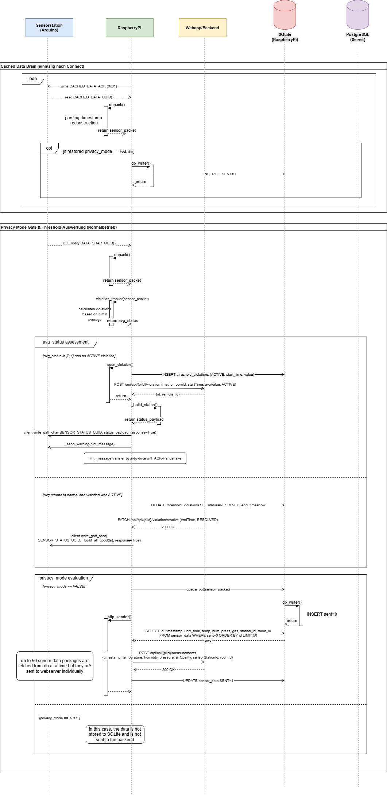
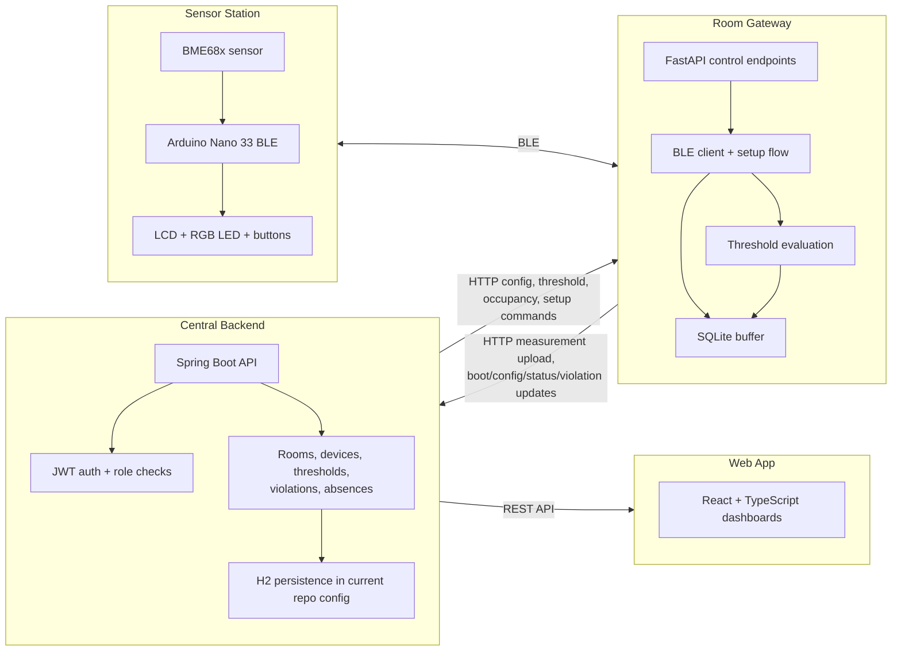

# ClimateCanary

ClimateCanary is an indoor environmental monitoring system that connects Arduino-based sensor stations, Raspberry Pi gateways, a Spring Boot backend, and a React web application to monitor office climate conditions and surface threshold violations in near real time.

It was developed as a university team project, but the repository documents it as an engineering system: hardware, gateway logic, backend APIs, privacy constraints, and the user-facing dashboards that tie the stack together.



## What Is ClimateCanary?

ClimateCanary monitors indoor conditions in office rooms and common areas. Sensor stations built around Arduino Nano 33 BLE hardware and a BME68x environmental sensor capture measurements, transmit them over Bluetooth Low Energy, and receive feedback about warning states. A Raspberry Pi assigned to the room acts as the local gateway: it authenticates stations, buffers measurements locally, evaluates thresholds, and synchronizes with the central backend. The web application exposes the resulting data with role-specific views for employees, department leads, management, and administrators.

The implementation is not just "sensors plus dashboard". It includes device onboarding, a custom BLE protocol, local persistence on the gateway, warning propagation back to the sensor station, role-based access control, and privacy rules tied to room occupancy.

## Key Capabilities

- Measures temperature, humidity, pressure, and air-quality-related sensor data on Arduino stations.
- Transfers measurements over a custom BLE GATT profile between the station and the Raspberry Pi gateway.
- Buffers measurements locally on both the sensor station and the Raspberry Pi to tolerate connectivity loss.
- Evaluates configurable thresholds on the Raspberry Pi and feeds warning states back to the sensor station.
- Persists room, device, user, absence, threshold, measurement, and violation data in the backend.
- Provides role-specific dashboards for employees, department leads, management, and administrators.
- Enforces occupancy-based privacy mode for office rooms by suppressing measurement persistence and backend upload when the configured minimum occupancy is not met.

## System Architecture



## How Data Flows Through The System

1. The Arduino reads environmental data from the BME sensor and exposes it over BLE.
2. A Raspberry Pi assigned to the room authenticates with the station and subscribes to live measurements.
3. The Pi reconstructs timestamps, evaluates the measurements against locally stored thresholds, and writes unsent data to SQLite.
4. If a violation is confirmed, the Pi reports it to the backend and sends warning state and hint text back to the Arduino over BLE.
5. A background sender on the Pi uploads buffered measurements to the backend in small batches and marks them as sent when the request succeeds.
6. The backend stores measurements and violations, applies access-control rules, and serves room- and role-specific views to the React frontend.
7. Occupancy changes can switch a room into privacy mode; in that mode the Pi still evaluates thresholds locally but stops persisting and uploading measurements.

## Engineering Highlights

- **Custom BLE onboarding and trust model**  
  Problem: identical sensor stations need a deterministic first-time setup flow.  
  Solution: the Pi scans for setup-mode devices, writes a `TrustedRpiId` and measurement interval to a dedicated setup characteristic, then reconnects in normal mode and authenticates through a separate warning/auth characteristic.  
  Why it matters: onboarding is explicit, repeatable, and bound to a room gateway instead of relying on ad hoc pairing.

- **Gateway-side buffering across connectivity failures**  
  Problem: the room gateway can lose backend connectivity without losing local sensor access.  
  Solution: the Pi stores measurements in SQLite with a `sent` flag and retries uploads in batches; the Arduino also maintains a local ring buffer for cached sensor packets.  
  Why it matters: the system keeps collecting data locally even when the backend is temporarily unavailable.

- **Threshold evaluation with time-window confirmation**  
  Problem: instantaneous spikes should not create noisy warnings.  
  Solution: the Pi evaluates a sliding window of recent measurements per metric and only opens a violation after sustained out-of-range values, with reminder cooldown logic and explicit resolution handling.  
  Why it matters: warnings reflect persistent conditions instead of transient spikes.

- **Bidirectional warning propagation**  
  Problem: alerts should be visible both in the web app and at the physical sensor station.  
  Solution: once a violation is confirmed, the Pi posts it to the backend and simultaneously pushes status codes and warning text chunks back to the Arduino.  
  Why it matters: the system closes the loop between backend state and the room device that users physically see.

- **Privacy mode tied to occupancy**  
  Problem: high-frequency room data for office spaces should not be stored when too few people are present.  
  Solution: the backend recalculates occupancy from room assignments and absences, pushes `privacyMode` changes to the Pi, and the Pi suppresses persistence and upload while still performing local threshold checks.  
  Why it matters: privacy constraints are enforced in the runtime architecture, not just in the UI.

- **Full-stack role separation**  
  Problem: different stakeholders need different views of the same system.  
  Solution: the backend uses JWT-based authentication and role-restricted routes, while the frontend presents separate dashboards for employees, department leads, management, and admins.  
  Why it matters: the project demonstrates more than device telemetry; it includes an access-controlled application model around it.

## My Contribution

- Designed and implemented the Arduino control logic, including device states, LCD/LED behavior, button handling, warning display flow, BLE-facing firmware behavior, and local buffering work.
- Contributed a substantial share of the backend and system-integration work around Raspberry Pi communication, sensor-station setup/assignment flows, threshold synchronization, violation handling, and privacy-mode updates.
- Worked on the integration boundary between the embedded/gateway side and the web platform so device state and room data could flow into the backend application model.
- Contributed to the React frontend in areas such as role-based routing, management/privacy-related behavior, room-history behavior, and administration flows.

## Technology Stack

| Layer | Technologies used in this repository |
| --- | --- |
| Sensor station | Arduino Nano 33 BLE, C++, ArduinoBLE, BSEC/BME68x sensor stack, Grove LCD |
| Gateway | Python, FastAPI, `bleak`, `aiohttp`, `aiosqlite`, SQLite |
| Backend | Java, Spring Boot, Spring Security, Spring Data JPA, JWT, OpenAPI |
| Frontend | React, TypeScript, Vite, PrimeReact, Axios |
| Build / packaging | Maven, npm, Docker multi-stage build, `docker-compose.prod.yml` |
| Testing | JUnit, Spring Boot test support, Mockito, frontend Testing Library setup |

## Repository Structure

```text
.
|-- arduino/                 # Sensor-station firmware
|-- raspberry_setup/         # Raspberry Pi gateway runtime
|-- src/main/java/           # Spring Boot backend
|-- src/main/frontend/       # React frontend
|-- src/test/                # Backend tests
|-- docs/                    # Diagrams and project assets
|-- circuit/                 # Hardware wiring diagrams
|-- Dockerfile               # Full-stack container build
`-- docker-compose.prod.yml  # Production-oriented container run config
```

## Running The Project

### Backend

The backend is a Spring Boot application with an in-memory H2 database in the checked-in configuration.

```bash
mvn spring-boot:run
```

The backend serves:

- the API on `http://localhost:8080`
- Swagger UI on `http://localhost:8080/swagger-ui/index.html`

### Frontend

The frontend lives in `src/main/frontend`.

1. Copy `src/main/frontend/.env_example` to `src/main/frontend/.env`.
2. Keep `REACT_APP_BACKEND_SERVER_URL=http://localhost:8080` for local development unless you are pointing to a different backend.
3. Start the frontend:

```bash
cd src/main/frontend
npm install
npm start
```

By default, Vite serves the app on `http://localhost:5173`.

### Raspberry Pi Gateway

The gateway runtime is in `raspberry_setup/`.

- `conf.yml` contains the Pi-side runtime configuration.
- `main.py` starts BLE handling, the local FastAPI service, SQLite initialization, threshold loading, and measurement upload workers.
- The backend can also push updated configuration and threshold data to the Pi at runtime.

### Arduino Firmware

The sensor-station firmware is a PlatformIO project in `arduino/src/ClimateCanary/`.

- Board target: `nano33ble`
- Key dependencies: `ArduinoBLE`, `BSEC Software Library`, Grove LCD driver

### Container Build

The repository contains a multi-stage `Dockerfile` that:

1. generates the frontend API client from the OpenAPI spec,
2. builds the React frontend,
3. packages the Spring Boot application,
4. runs the backend as a single containerized service.

`docker-compose.prod.yml` expects `APP_JWT_SECRET` to be supplied as an environment variable.

## Testing And Quality Assurance

- Backend tests live under `src/test/java` and cover controllers, services, repositories, and DTO mappers.
- The backend build is configured with JaCoCo for coverage reporting.
- The frontend includes a Testing Library setup and an `App.test.tsx` scaffold, but the backend test suite is currently the stronger documented test surface in the repository.
- OpenAPI documentation is generated from the backend and checked into `src/main/resources/api-docs.json`, with a generated TypeScript client used by the frontend.

## Documentation

- Wiki home: [`ClimateCanary.wiki/home.md`](../ClimateCanary.wiki/home.md)
- Architecture: [`ClimateCanary.wiki/Architecture.md`](../ClimateCanary.wiki/Architecture.md)
- Sensor station: [`ClimateCanary.wiki/Sensor-Station-(Arduino).md`](../ClimateCanary.wiki/Sensor-Station-(Arduino).md)
- Raspberry Pi gateway: [`ClimateCanary.wiki/Raspberry-Pi-Gateway.md`](../ClimateCanary.wiki/Raspberry-Pi-Gateway.md)
- Backend: [`ClimateCanary.wiki/Backend.md`](../ClimateCanary.wiki/Backend.md)
- Privacy and occupancy: [`ClimateCanary.wiki/Privacy-and-Occupancy.md`](../ClimateCanary.wiki/Privacy-and-Occupancy.md)
- Threshold and warning flow: [`ClimateCanary.wiki/Threshold-and-Warning-System.md`](../ClimateCanary.wiki/Threshold-and-Warning-System.md)
- Portfolio-ready project summary: [`docs/portfolio-summary.md`](docs/portfolio-summary.md)

The existing long-form course documentation remains in the wiki as a deeper historical reference, especially [`ClimateCanary.wiki/Software-Konzept.md`](../ClimateCanary.wiki/Software-Konzept.md).

## Project Context

ClimateCanary was developed in the context of a university software-engineering course at the University of Innsbruck. The repository still contains traces of the original course starter structure in package names such as `at.qe.skeleton`, but the implementation itself is a full multi-component system rather than a starter template.

Team members listed in the existing project wiki:

- Adriano Paganini
- Emma Danko
- Maria Kuhn
- Fabienne Schedler
- Prahbdip Singh

## License

No repository license file is currently present.
